# Architecture Report: Vite + React → Next.js Migration

**Project**: personal-win95 (Windows 95-themed personal portfolio)  
**Date**: February 18, 2026  
**Migration**: Vite 7 + React 19 SPA → Next.js 16 App Router  

---

## Table of Contents

1. [Executive Summary](#1-executive-summary)
2. [Problem Statement: Why Migrate?](#2-problem-statement-why-migrate)
3. [Architecture Overview](#3-architecture-overview)
4. [File Structure](#4-file-structure)
5. [Component Hierarchy & Server/Client Boundary](#5-component-hierarchy--serverclient-boundary)
6. [Data Flow Architecture](#6-data-flow-architecture)
7. [SEO Implementation](#7-seo-implementation)
8. [Styling Architecture](#8-styling-architecture)
9. [Image Optimization](#9-image-optimization)
10. [Build & Deployment](#10-build--deployment)
11. [Migration Decisions & Trade-offs](#11-migration-decisions--trade-offs)
12. [Future Improvements](#12-future-improvements)

---

## 1. Executive Summary

This document describes the architecture of the migrated Next.js portfolio application. The migration's primary goal was **SEO improvement** — the original Vite SPA served an empty HTML shell to search engine crawlers, making all portfolio content invisible to indexing.

The solution introduces a **dual-render architecture**: a Next.js Server Component renders all portfolio content as semantic, crawlable HTML, while a Client Component overlays the interactive Windows 95 desktop experience. Crawlers see a fully-indexed page; users see the retro desktop.

### Key Results

| Metric | Before (Vite SPA) | After (Next.js) |
|---|---|---|
| Server-rendered HTML content | ❌ Empty `<div id="root">` | ✅ Full semantic HTML |
| JSON-LD structured data | ❌ None | ✅ Person schema |
| Meta tags (title, OG, description) | ❌ Basic `<title>` only | ✅ Full metadata |
| Sitemap | ❌ None | ✅ `/sitemap.xml` |
| robots.txt | ❌ None | ✅ Crawler-friendly |
| Static prerendering | ❌ Client-only | ✅ All routes prerendered |
| Image optimization | ⌠Raw `` tags | ✅ `next/image` |
| Interactive desktop UX | ✅ Full Win95 | ✅ Identical Win95 |

---

## 2. Problem Statement: Why Migrate?

### The SPA SEO Gap

The original Vite + React application was a single-page application (SPA). When deployed, the server responds with:

```html
<div id="root"></div>
<script type="module" src="/src/main.tsx"></script>
```

Search engine crawlers receive **zero indexable content**. While Googlebot can execute JavaScript, it does so in a secondary rendering queue with lower priority. Other search engines (Bing, DuckDuckGo, Baidu) largely do not execute JavaScript at all.

### Why a 1:1 Migration Wouldn't Help

The application's content is gated behind user interaction — double-clicking desktop icons opens windows that render the actual portfolio content. Even with Next.js server-side rendering, a naive migration would mark the entire page as `"use client"`, meaning the server would only render the desktop shell (teal background, icons, taskbar) — not the portfolio content.

### The Solution: Architectural Split

The migration required an **architectural redesign** that separates:
1. **SEO content** (server-rendered, visually hidden) — what crawlers see
2. **Interactive UI** (client-rendered, visual) — what users see

---

## 3. Architecture Overview

```mermaid
graph TB
    subgraph "Next.js Server (Build Time)"
        Layout["layout.tsx<br/>(Server Component)"]
        Page["page.tsx<br/>(Server Component)"]
        Layout --> Page
        
        Page --> Meta["Metadata API<br/>title, description, OG"]
        Page --> JSONLD["JSON-LD Script<br/>Person Schema"]
        Page --> SEO["Hidden Semantic HTML<br/>(sr-only div)"]
        Page --> Shell["DesktopShell<br/>(Client Component)"]
    end

    subgraph "Client (Browser)"
        Shell --> Icons["DesktopIcon ×5"]
        Shell --> Windows["WindowController ×N"]
        Shell --> TB2["Taskbar"]
        
        Windows --> WF["WindowFrame"]
        WF --> Sections["Section Components"]
        
        Shell -.->|useState| WinState["Window State<br/>openWindows, focusedWindow,<br/>minimizedWindows, selectedIcon"]
    end

    subgraph "Shared (Framework-Agnostic)"
        Config["config.ts<br/>PortfolioConfig"]
        Hooks["useDraggable<br/>useResizable"]
        IconsSVG["Icons.tsx<br/>SVG Components"]
    end

    Page -->|"imports data"| Config
    Shell -->|"receives as prop"| Config
    Windows -->|"uses"| Hooks

    style Layout fill:#2d5016,color:#fff
    style Page fill:#2d5016,color:#fff
    style Shell fill:#000080,color:#fff
    style Icons fill:#000080,color:#fff
    style Windows fill:#000080,color:#fff
    style TB2 fill:#000080,color:#fff
    style WinState fill:#4a0080,color:#fff
    style Config fill:#555,color:#fff
    style Hooks fill:#555,color:#fff
```



**Legend**: 🟢 Green = Server Component | 🔵 Blue = Client Component | ⬛ Gray = Shared/Framework-agnostic

---

## 4. File Structure

```
personal-win95/
├── public/
│   ├── icons/                    # Desktop icon images (8 files)
│   │   ├── Notes.png
│   │   ├── Books.png
│   │   ├── LinkedIn.png
│   │   ├── DocumentsFolder.ico
│   │   ├── Contacts.png
│   │   ├── App-Store.png
│   │   ├── Files.png
│   │   └── Safari.png
│   ├── logo.jpeg                 # Favicon + avatar
│   ├── qimia.png                 # Company logos
│   ├── upt.png
│   ├── ticimax.png
│   ├── atasehir.png
│   ├── marmara.png               # Education logos
│   ├── uvt.png
│   ├── memoria.png               # Project images
│   ├── HackUPC.jpg
│   ├── ATS-Resume-Scorer.mp4     # Project videos
│   ├── Tria.mp4
│   └── robots.txt                # SEO: crawler directives
│
├── src/
│   ├── app/
│   │   ├── globals.css           # Win95 theme (Tailwind v4)
│   │   ├── layout.tsx            # Root layout (Server Component)
│   │   ├── page.tsx              # Homepage (Server Component — SEO core)
│   │   └── sitemap.ts            # Dynamic sitemap generation
│   │
│   ├── components/
│   │   ├── DesktopShell.tsx      # 🔑 Client Component — window management
│   │   ├── Icons.tsx             # SVG icon components
│   │   ├── ProjectCard.tsx       # Project display card (next/image)
│   │   ├── ResumeCard.tsx        # Work/Education card (next/image)
│   │   ├── retro/
│   │   │   ├── DesktopIcon.tsx   # "use client" — touch/click handling
│   │   │   ├── Taskbar.tsx       # "use client" — live clock
│   │   │   └── WindowFrame.tsx   # "use client" — drag/resize UI
│   │   ├── sections/
│   │   │   ├── index.ts          # Barrel exports
│   │   │   ├── HeroSection.tsx
│   │   │   ├── AboutSection.tsx
│   │   │   ├── WorkSection.tsx
│   │   │   ├── EducationSection.tsx
│   │   │   ├── SkillsSection.tsx
│   │   │   ├── ProjectsSection.tsx
│   │   │   └── ContactSection.tsx
│   │   └── ui/
│   │       ├── index.ts          # Barrel exports
│   │       ├── Avatar.tsx        # next/image integration
│   │       ├── Badge.tsx
│   │       ├── Card.tsx
│   │       └── Section.tsx
│   │
│   ├── data/
│   │   └── config.ts             # Portfolio data + TypeScript interfaces
│   │
│   └── hooks/
│       ├── useDraggable.ts       # Window drag logic (mouse + touch)
│       └── useResizable.ts       # Window resize logic (8 directions)
│
├── next.config.ts
├── tsconfig.json
├── postcss.config.mjs
└── package.json
```

**Total**: 30 source files (excluding config/lockfiles)

---

## 5. Component Hierarchy & Server/Client Boundary

The `"use client"` boundary is drawn precisely at the `DesktopShell` component. Everything above it (in the component tree) is a Server Component; everything inside it is client-rendered.


### Why This Boundary?

- **`page.tsx` stays as Server Component** — it renders static config data as HTML at build time. No hooks, no browser APIs, no interactivity.
- **`DesktopShell` is the client boundary** — it manages 4 pieces of `useState` (openWindows, focusedWindow, minimizedWindows, selectedIcon) and uses `window.innerWidth` for mobile detection.
- **Section components don't need `"use client"`** — they're imported and rendered within the client tree (DesktopShell), so they automatically become client components. They contain no hooks themselves.
- **Retro components explicitly declare `"use client"`** — because they use React hooks (`useState`, `useEffect`) and browser event handlers directly.

---

## 6. Data Flow Architecture

All portfolio data lives in a single `config.ts` file with full TypeScript typing:


### PortfolioConfig Interface

```typescript
interface PortfolioConfig {
  personalInfo: PersonalInfo;    // name, greeting, tagline, avatarUrl, about
  skills: string[];              // skill badge labels
  workExperience: WorkExperience[];  // company, role, period, logo, badges
  education: Education[];        // institution, degree, period, logo, badges
  projects: Project[];           // title, description, tech, links, media
  socials: SocialLink[];         // name + url pairs
  contact: ContactInfo;          // message, socialLink, disclaimer
}
```

**Key design decision**: The config is imported twice — once by the Server Component (for SEO HTML) and once passed as a prop to the Client Component (for interactive windows). This means the data is serialized once at build time and hydrated on the client. Since it's static data (no API calls), this adds negligible overhead.

---

## 7. SEO Implementation

### 7.1 Next.js Metadata API

The root layout exports a `metadata` object that Next.js automatically converts to `<head>` tags:

```typescript
export const metadata: Metadata = {
  title: "Yunus Ege Küçük | Win95 Themed Personal Page",
  description: "Software Engineer portfolio — experience in web development, AI projects, and open-source tools."
};
```

This generates:
```html
<title>Yunus Ege Küçük | Win95 Themed Personal Page</title>
<meta name="description" content="Software Engineer portfolio...">
<link rel="icon" href="/logo.jpeg">
```

### 7.2 JSON-LD Structured Data

A `Person` schema is embedded as a `<script type="application/ld+json">` in the page, providing rich search results:

```json
{
  "@context": "https://schema.org",
  "@type": "Person",
  "name": "Yunus Ege Küçük",
  "jobTitle": "Software Engineer",
  "url": "https://yegekucuk.github.io",
  "sameAs": ["GitHub", "LinkedIn", "X URLs"],
  "alumniOf": ["Marmara University", "UVT"],
  "knowsAbout": ["Machine Learning", "Web Development", ...]
}
```

### 7.3 Server-Rendered Semantic HTML

The `sr-only` div contains full semantic HTML that crawlers can parse:

```html
<div class="sr-only" aria-hidden="false">
  <h1>Hi, I'm Ege — Ege</h1>
  <article><h2>About</h2><p>...</p></article>
  <article><h2>Skills</h2><ul>...</ul></article>
  <article><h2>Work Experience</h2>...</article>
  <article><h2>Education</h2>...</article>
  <article><h2>Projects</h2>...</article>
  <article><h2>Contact</h2>...</article>
</div>
```

**Key points**:
- Uses `sr-only` (screen-reader only) — visually hidden but fully present in DOM
- `aria-hidden="false"` ensures screen readers can access it
- Semantic tags (`<article>`, `<h1>`–`<h3>`, `<ul>`, `<nav>`) provide structure
- Project links are real `<a>` tags that crawlers can follow

### 7.4 Sitemap & robots.txt

- **`/sitemap.xml`**: Generated dynamically by Next.js from `src/app/sitemap.ts`. Single entry pointing to the homepage with `monthly` change frequency.
- **`/robots.txt`**: Static file allowing all crawlers, pointing to the sitemap.

### 7.5 Static Prerendering

The build output confirms all routes are statically prerendered:

```
Route (app)
┌ ○ /
├ ○ /_not-found
└ ○ /sitemap.xml

○  (Static)  prerendered as static content
```

This means the server responds with complete HTML on the first request — no server-side rendering at request time needed.

---

## 8. Styling Architecture

### Tailwind CSS v4

Both the original and migrated projects use Tailwind CSS v4 with PostCSS:

```javascript
// postcss.config.mjs
const config = {
  plugins: {
    "@tailwindcss/postcss": {},
  },
};
```

### Theme System

All theme tokens are defined in `globals.css` using Tailwind v4's `@theme` directive (not a `tailwind.config.js`):

```css
@theme {
  --color-primary: hsl(var(--primary));          /* Navy #000080 */
  --color-card: hsl(var(--card));                /* Silver #c0c0c0 */
  --color-background: hsl(var(--background));    /* Teal #008080 */
  --font-sans: 'MS Sans Serif', 'Segoe UI', sans-serif;
  /* ... 20+ tokens */
}
```

### Win95 Utility Classes

Custom CSS classes simulate the classic Win95 beveled border effect:

| Class | Effect |
|---|---|
| `.win95-border-outset` | Raised 3D border (buttons, window chrome) |
| `.win95-border-inset` | Sunken 3D border (content areas, focused tasks) |
| `.win95-btn` | Button with outset border + active press effect |
| `.icon-blue-overlay` | Navy overlay on selected desktop icons |

These use `box-shadow` with multiple insets to create the characteristic layered border appearance.

---

## 9. Image Optimization

All images were migrated from raw `` tags to Next.js `next/image`:

| Component | Image Type | Width × Height |
|---|---|---|
| `Avatar.tsx` | Profile photo | 48/80/112 (by size variant) |
| `DesktopIcon.tsx` | Desktop icons | 32 × 32 |
| `ResumeCard.tsx` | Company/school logos | 48 × 48 |
| `ProjectCard.tsx` | Project screenshots | 600 × 160 |

**Benefits**:
- Automatic WebP/AVIF format conversion
- Lazy loading by default
- Proper `width`/`height` prevents layout shift (CLS)
- Responsive `srcSet` generation

**Note**: Project videos (`<video>` tags) remain as-is — `next/image` does not support video.

---

## 10. Build & Deployment

### Build Results

```
✓ Compiled successfully in 1555.7ms
✓ TypeScript passed
✓ ESLint passed (zero warnings)
✓ All 3 routes statically prerendered
```

### Deployment Considerations

The app is configured for static export (all routes are `○ Static`), making it compatible with:
- **GitHub Pages** (current target: `yegekucuk.github.io`)
- Vercel (zero-config)
- Netlify
- Any static hosting

For GitHub Pages deployment, add to `next.config.ts`:
```typescript
const nextConfig: NextConfig = {
  output: 'export',
  images: { unoptimized: true }, // Required for static export
};
```

---

## 11. Migration Decisions & Trade-offs

### Decision 1: Dual Rendering (Server + Client)

**Trade-off**: Portfolio content exists twice in the DOM — once as hidden semantic HTML, once inside interactive windows.

**Why**: The Win95 desktop metaphor requires all content to be gated behind user interaction (opening windows). Crawlers cannot "double-click" icons. The hidden HTML layer ensures SEO indexing without compromising the interactive UX.

**Impact**: ~7KB additional DOM size. Negligible performance impact since the hidden content is static text.

### Decision 2: Single `"use client"` Boundary

**Trade-off**: The entire desktop UI is a single client component tree rooted at `DesktopShell`.

**Why**: Window management state (`openWindows`, `focusedWindow`, etc.) is global to the desktop — splitting it across multiple client boundaries would require a state management library (Redux, Zustand) for cross-component communication. A single boundary keeps the state model simple.

### Decision 3: Config as Prop (Not Context)

**Trade-off**: Config data is passed as a prop from `page.tsx` → `DesktopShell`, then destructured and passed down.

**Why**: Context would require a Provider (client component), pushing the client boundary higher. Props are simpler, serialize cleanly across the server/client boundary, and the data is small (~7KB).

### Decision 4: No Route-Based Content

**Trade-off**: All content lives on a single page (`/`), not separate routes (`/about`, `/projects`).

**Why**: The Win95 desktop metaphor is a single-screen experience. Separate routes would break the desktop simulation. The `sr-only` SEO content compensates for the lack of separate URL paths.

---

## 12. Future Improvements

### Short-term
- **Open Graph image**: Generate a custom OG image showing the Win95 desktop for social media previews  
- **`next.config.ts` static export**: Add `output: 'export'` for GitHub Pages deployment
- **Start menu**: Implement the Start menu (currently shows `alert()`)

### Medium-term
- **Keyboard navigation**: Add keyboard shortcuts (Alt+F4 to close, etc.)
- **Window maximize**: Implement the maximize button functionality
- **Persisted state**: Save open windows to `localStorage` so returning visitors see their last session

### Long-term
- **Multiple pages**: Add sub-routes (e.g., `/blog`) that integrate with the desktop metaphor (as "applications")
- **Dynamic content**: Fetch project data from GitHub API for live star counts and latest repos
- **Accessibility audit**: Ensure screen readers can navigate both the interactive desktop and the semantic content
